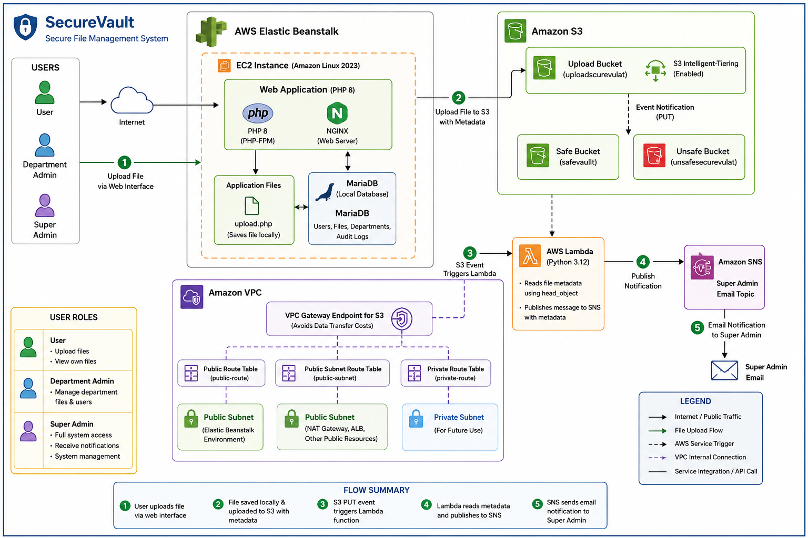

# SecureVault — File Fortress Dashboard System

## Overview

SecureVault is a secure file and user management system built with **PHP 8** and **MariaDB**, featuring a full **Role-Based Access Control (RBAC)** model for departmental file isolation and cross-department access requests.

The application is deployed on **AWS Elastic Beanstalk** (Amazon Linux 2023) running **NGINX + PHP-FPM**, with uploaded files pushed to **Amazon S3**, monitored via an event-driven **Lambda + SNS** notification pipeline, and networked through a hardened **VPC** configuration.

---

## Architecture

The diagram above illustrates the full request and data flow:

1. Users interact with SecureVault through a web interface served by Elastic Beanstalk (EC2 + NGINX + PHP-FPM).
2. On upload, `upload.php` saves the file locally and pushes it to S3 with metadata (uploader email, department, original filename).
3. The S3 **Upload Bucket** (`uploadscurevulat`) triggers a **PUT event notification**.
4. An **AWS Lambda** function (Python 3.12) reads the object metadata via `head_object`.
5. Lambda publishes a message to an **Amazon SNS** topic.
6. SNS emails the Super Admin with the file name, uploader, and department.

Supporting infrastructure includes:
- **S3 Intelligent-Tiering** on the upload bucket for automatic cost optimization
- **Safe** and **Unsafe** S3 buckets for file classification
- **VPC Gateway Endpoint for S3** to avoid NAT/data-transfer costs
- Public/private route tables and subnets, with a private subnet reserved for future use

---

## Tech Stack

| Layer | Technology |
|---|---|
| Language | PHP 8 |
| Web Server | NGINX (PHP-FPM) |
| Database | MariaDB |
| Hosting | AWS Elastic Beanstalk (EC2, Amazon Linux 2023) |
| Storage | Amazon S3 |
| Event Processing | AWS Lambda (Python 3.12) |
| Notifications | Amazon SNS |
| Networking | Amazon VPC + Gateway Endpoint |
| Dependency Management | Composer + AWS SDK for PHP |
| Auth (in progress) | AWS Cognito User Pool |

---

## Access URLs (Localhost)

| Page | URL | Access |
|---|---|---|
| Login | `http://localhost/securevault_/login.php` | Public |
| Register | `http://localhost/securevault_/register.php` | Public |
| Super Admin Dashboard | `http://localhost/securevault_/super_admin_dashboard.php` | Super Admin Only |
| Department Admin Dashboard | `http://localhost/securevault_/admin_dashboard.php` | Department Admin Only |
| User Dashboard | `http://localhost/securevault_/dashboard.php` | User Only |
| Logout | `http://localhost/securevault_/logout.php` | Authenticated Users |

## Default Credentials

| # | Username | Email | Role | Password |
|---|---|---|---|---|
| 1 | `superadmin` | `superadmin@securevault.local` | Super Admin | `Admin@12345` |
| 2 | `Mohamed` | `mohamed@securevault.local` | Department Admin | `Mohamed@12345` |
| 3 | `Yousef` | `yousef@securevault.local` | User | `Admin@12345` |
| 4 | `Ahmed` | `ahmed@securevault.local` | Department Admin | `Admin@12345` |

> **Unified Security Code:** `SV-ACCESS-2026`

---

## Project Structure

```plaintext
secureVault/
├── uploads/                    # File uploads directory
├── auth.php                    # Authentication & Authorization system
├── db.php                      # Database connection configuration
├── layout.php                  # Shared layout templates (Header/Footer)
├── index.php                   # Main entry point / router
├── login.php                   # Login page with slide panels
├── logout.php                  # Session destruction & logout
├── register.php                # User self-registration page
├── dashboard.php                # Regular user dashboard
├── admin_dashboard.php          # Department admin dashboard
├── super_admin_dashboard.php    # Super admin dashboard
├── upload.php                   # File upload handler (local + S3)
├── download.php                 # Secure file download handler
├── preview.php                  # In-browser file preview handler
├── request_access.php           # Cross-department access request handler
├── schema.sql                   # Full database schema for fresh installs
└── migration_update.sql         # Database migration for existing installs
```

---

## Features

### 1. Three-Tier Role-Based Access Control (RBAC)

| Role | Permissions |
|---|---|
| `super_admin` | Full platform control, department & user management, unlimited file access, full audit log visibility |
| `department_admin` | Manage department, create users, upload files, review registrations & access requests |
| `user` | Upload files to home department, request cross-department access, track request status |

### 2. Secure File Management
- Whitelisted file extension/type validation on upload
- Encrypted storage using randomized hexadecimal filenames
- Protected downloads via `download.php` with permission checks
- Inline preview support for images, PDFs, and common text formats

### 3. Cross-Department Access Requests
Secure requests to other departments with a full review workflow by department admins.

### 4. Real-Time Notification System
New registrations, access requests, failed login alerts, and other security/approval events.

### 5. Comprehensive Audit Logging
Login attempts, uploads/downloads, and access requests are all logged.

### 6. Security Hardening

| Enhancement | Description |
|---|---|
| SQL Injection Prevention | All queries use PDO Prepared Statements with parameterized binding |
| CSRF Protection | Token generation and verification on form submissions |
| XSS Prevention | Output safely encoded with `htmlspecialchars()` |
| Brute Force Detection | Admin alert after 4+ failed login attempts |
| Secure File Storage | Randomized filenames to prevent direct access |
| Password Hashing | `password_hash()` (bcrypt) |
| Session Regeneration | New session ID issued on every successful login |

### 7. Interactive Dashboards
- **Super Admin** — activity tracking, threat analysis, network traffic visualization
- **Department Admin** — user management, registration & access request reviews
- **User** — file access, personal request status tracking

---

## Database Schema

| Table | Description | Key Columns |
|---|---|---|
| `departments` | Organizational departments | id, name |
| `users` | All user accounts (3 roles) | id, username, email, password |
| `files` | Uploaded files with ownership | id, department_id, file_name |
| `access_requests` | Cross-department access requests | id, user_id, status |
| `audit_logs` | Complete audit trail | id, user_id, event_type |
| `notifications` | User & department notifications | id, user_id, department_id |

---

## Cloud Upload & Notification Flow

1. User uploads a file via the web interface
2. File is saved locally and uploaded to S3 with metadata
3. S3 PUT event triggers the Lambda function
4. Lambda reads the metadata and publishes to SNS
5. SNS sends an email notification to the Super Admin

**AWS services used:** Elastic Beanstalk, EC2, MariaDB (local), S3 (3 buckets), Lambda, SNS, IAM, VPC Gateway Endpoint, S3 Intelligent-Tiering, Cognito (User Pool created, integration pending)

---

## Deployment Journey

The application was originally built and tested locally on **XAMPP**, then migrated to a production AWS environment through the following steps:

1. Deployed the app on Elastic Beanstalk (Amazon Linux 2023)
2. Installed MariaDB manually on the EC2 instance, since it isn't bundled with the platform
3. Fixed MariaDB authentication so PHP could connect over TCP instead of the default socket auth
4. Installed Composer and the AWS SDK for PHP
5. Modified `upload.php` to push files to S3 along with metadata (uploader email, department, original filename)
6. Created an SNS topic with an email subscription for the Super Admin
7. Built a Lambda function (Python 3.12), triggered by S3 PUT events, to read file metadata and publish SNS notifications
8. Attached IAM permissions (`AmazonS3FullAccess` + `AmazonSNSFullAccess`) to the Lambda execution role
9. Configured an S3 Event Notification to invoke the Lambda on every upload
10. Set up a VPC Gateway Endpoint for S3 to eliminate NAT data-transfer costs
11. Enabled S3 Intelligent-Tiering on the upload bucket
12. Began configuring an AWS Cognito User Pool for centralized authentication

---

## Troubleshooting Log

Real issues encountered during deployment, along with root causes and fixes:

| Issue | Root Cause | Fix |
|---|---|---|
| `directory index is forbidden` (NGINX) | MariaDB wasn't installed, so PHP crashed before rendering | Installed MariaDB, which resolved the underlying PHP error |
| `SQLSTATE[HY000] [2002] Connection refused` | MariaDB wasn't installed on the EC2 instance | Installed `mariadb105-server` |
| `SQLSTATE[HY000] [1698] Access denied for user 'root'@'localhost'` | MariaDB defaults to `unix_socket` auth | Ran `ALTER USER 'root'@'localhost' IDENTIFIED VIA mysql_native_password USING PASSWORD('');` |
| `413 Request Entity Too Large` | NGINX default body size limit | Added `client_max_body_size 20M;` to `nginx.conf` |
| `vendor/autoload.php not found` | Composer was run in the wrong directory | Re-ran Composer inside `/var/app/current/` |
| PHP parse error at line 91 in `upload.php` | A bash command was accidentally pasted into the PHP file during a `vim` edit | Rewrote the file cleanly using `cat > upload.php << 'EOF'` |
| `Runtime.UserCodeSyntaxError` in Lambda at line 33 | SNS `TopicArn` was missing quotes in the Python code | Wrapped the ARN in single quotes |
| `403 Forbidden` on `HeadObject` | Lambda execution role lacked S3 permissions | Attached `AmazonS3FullAccess` to the role |
| `404 Not Found` on `HeadObject` | Test event referenced a non-existent object key | Confirmed the fix by testing with a real, existing file key |

### General Troubleshooting Reference

| Issue | Solution |
|---|---|
| Database connection failed | Verify MySQL/MariaDB is running and `db.php` credentials match your setup |
| File upload fails | Check that `uploads/` exists and has write permissions (755/777) |
| Login redirects back to login page | Clear browser cookies/session and try again |
| CSRF token invalid | Refresh the page to generate a new token |
| Cannot preview/download file | Ensure the file exists in `uploads/` and you have access rights |
| Notifications not appearing | Run `migration_update.sql` to create the notifications table |

---

## Change Log

### Version 2.0 (Current)

**New**
- Notifications table with role-scoped delivery system
- Metadata column in `access_requests` for detailed request info
- Pending user status for the registration approval workflow

**Security**
- All SQL queries converted from inline to prepared statements
- Brute force detection (4+ failures triggers admin alerts)
- File size limit enforcement (10MB max)

**Enhanced**
- `logNotification()` function extended to 6 parameters, including `$requestId`
- `error_log()` integration for silent error tracking
- Extended file preview support (gif, webp, svg, json, xml, html, css, js, md, log)
- Improved "Preview Unavailable" page with file metadata display
- Download handler updated with cache-control headers and output buffer cleaning

**Performance**
- Strategic database indexes added for all frequent query patterns

**Data**
- 6 default departments seeded on install

**UI**
- Autocomplete attributes added to login/register forms

**Robustness**
- Department existence validation added before registration/upload

**Audit**
- Added audit log entries for preview attempts and download denials

---

## Roadmap

- [ ] Complete AWS Cognito User Pool integration for centralized authentication
- [ ] Replace broad IAM policies (`AmazonS3FullAccess`, `AmazonSNSFullAccess`) with least-privilege scoped policies
- [ ] Move MariaDB off the EC2 instance to a managed Amazon RDS instance
- [ ] Add automated tests for the upload → S3 → Lambda → SNS pipeline

---

## Important Codes

| Code | Purpose |
|---|---|
| `SV-ACCESS-2026` | Security code required for cross-department access requests |
| `Admin@12345` | Unified default password for all seeded accounts |
